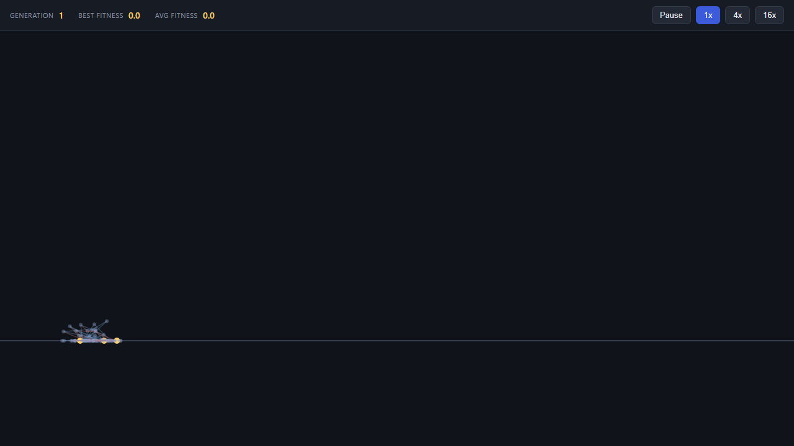
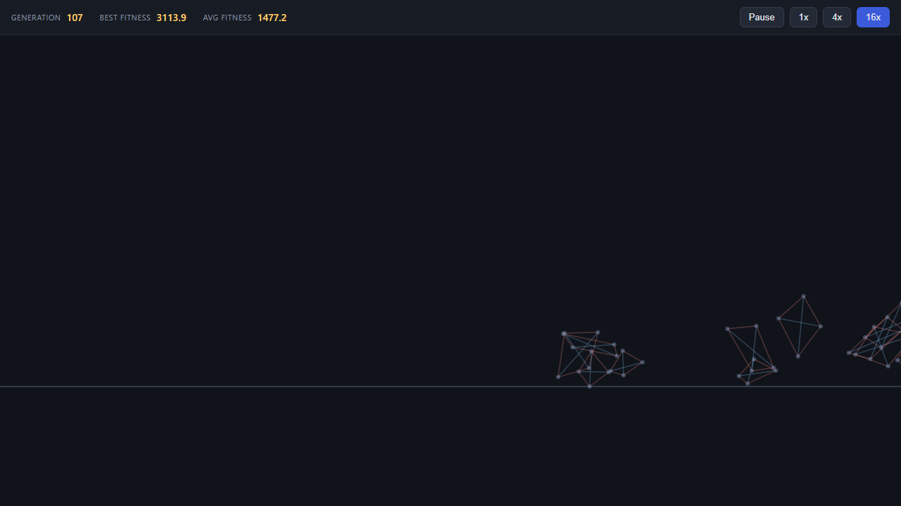
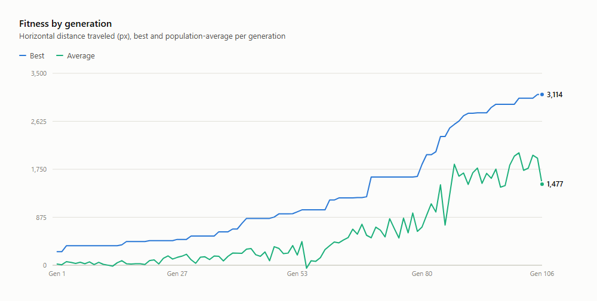
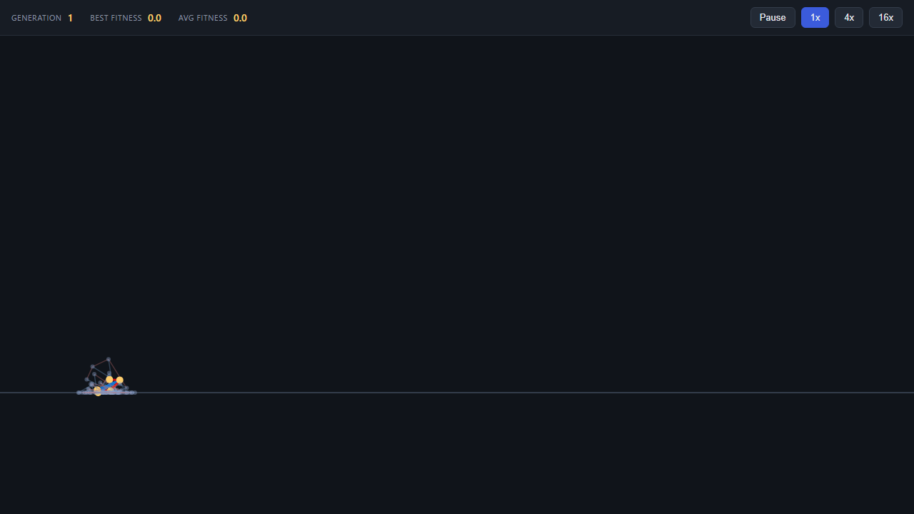
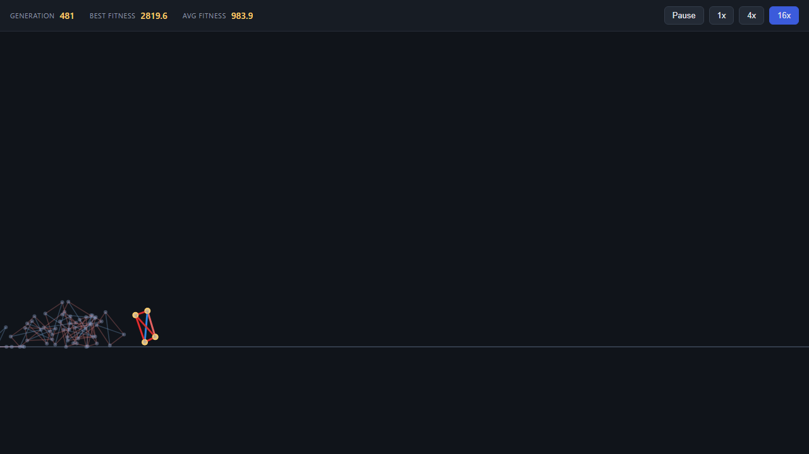
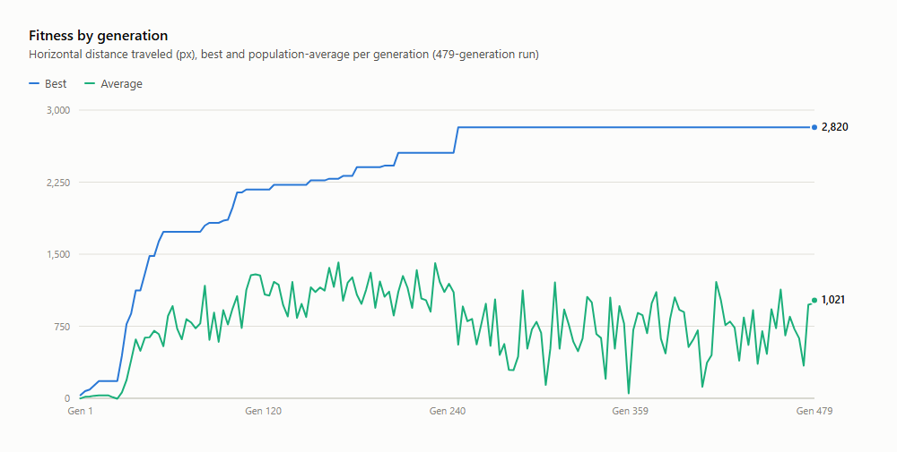

# Genetic Pets

A browser-based evolution simulator: soft-body creatures made of point-mass "nodes" connected by oscillating "muscles" are dropped into a 2D world with gravity and ground friction. Each generation, every creature is scored on how far it travels; the fittest are bred (with mutation) into the next generation. Over time, locomotion strategies emerge — walking, hopping, crawling — with no hand-coded animation, purely from selection pressure.

Inspired by [David Randall Miller's "I programmed some creatures. They Evolved."](https://youtu.be/N3tRFayqVtk)

## How it works

- **Creature**: a small graph of nodes (mass points) and muscles (springs whose rest length oscillates sinusoidally over time).
- **Genome**: per-creature parameters — node layout, muscle connections, and each muscle's amplitude/phase/frequency/base length.
- **Physics**: custom lightweight Verlet-style integration — gravity, ground collision, friction. No physics engine dependency.
- **Fitness**: net horizontal distance traveled during a fixed simulation window.
- **Evolution**: each generation, the population is ranked by fitness; top performers survive and are mutated (and optionally crossed over) to fill the next generation.

## Stack

TypeScript + HTML5 Canvas, built with Vite. Runs entirely client-side.

## Running locally

```bash
npm install
npm run dev
```

Then open the printed local URL in your browser.

## Current functioning

**Generation 1** — random genomes, no selection pressure yet. Creatures are small tangles of nodes/muscles twitching roughly in place.



**Generation 107** (same run, ~40s later at 16x speed) — selection has pushed the population toward larger, more spread-out body plans that cover real ground. Best fitness went from 0 to 3,114px; population average reached 1,477px.



## Analysis



Data from a single 107-generation run (population 20, elitism 2, 2 fresh-random per generation, rest bred via tournament selection + mutation):

- **Best fitness climbs in steps, not a smooth curve.** Elitism carries the current champion forward unchanged each generation, so the line is flat until a mutation of a top performer (or a lucky random genome) beats it — then it jumps and holds. This is expected behavior for a (μ+λ)-style elitist GA rather than a bug.
- **Average fitness is noisy and trails well behind best** (1,477 vs 3,114 at generation 107) because most of the population each generation is a fresh mutation of a parent — many mutations are neutral or harmful, so the mean reflects a lot of unsuccessful exploration around the current best, not convergence.
- **The gap between best and average is the diversity/exploration tradeoff.** A tighter gap would mean the population converges faster but explores less; a wider one (like here) means more of the search space gets tried at the cost of a lower average per generation.
- **No plateau yet by generation 107** — best fitness was still increasing at the end of the captured run, suggesting the current body plans (3-6 nodes, mutation-only, no crossover) haven't hit a hard ceiling.

### Ideas for further improvement

- Crossover between two fit parents (currently mutation-only / asexual reproduction).
- Adaptive mutation rate that shrinks as the population converges, to reduce late-run noise in the average.
- Larger populations or longer per-generation simulation windows to reduce the effect of a single lucky early step.

## Longer runs: does it plateau?

Ran the same setup for 479 generations (~3 minutes at 16x) to see what happens past the point the first experiment stopped.







- **It plateaus hard, and stays there.** Best fitness climbed fast for the first ~250 generations, then locked at 2,820px from generation ~247 through 479 (230+ generations, no improvement at all).
- **The winning "creature" is a degenerate trick, not a walker.** The elite genome that took over is a tiny 3-node body (visible far ahead of the rest of the pack in the generation-481 screenshot) that discovered some cheap flipping/launching motion instead of anything gait-like. Once elitism locks that in, later mutations of it rarely beat it, because there's little left to improve on a 3-node structure — the trick is already close to maximally exploiting the physics.
- **Average fitness didn't converge toward best this time — it went the other way.** It peaked around generation 120-150 (~1,000-1,400px) then drifted down and stayed noisy in the 400-1,000px range for the rest of the run, well below its own earlier peak. Comparing this to an earlier 107-generation run (where average tracked much closer to best) suggests the *specific* elite genome matters a lot: a fragile, minimal-body trick doesn't tolerate mutation well, so most offspring of the champion fall far short of it, unlike a more robust body plan.
- **Runs are not very reproducible in outcome.** Two independent long runs plateaued at different fitness values via different strategies (one shows average catching up to best, the other shows a widening gap) — a reminder that with a small population (20) and mutation-only reproduction, early random draws have an outsized effect on where the whole run ends up.

This also surfaced a real bug: at high sim speed the camera (which follows the leading creature) only re-centered once per rendered frame, so it fell further and further behind the true leader position and the population went off-screen for most of a fast-forwarded run. Fixed by updating the camera every simulation step instead of once per animation frame ([src/main.ts](src/main.ts)).

### Ideas this suggests

- Penalize or filter out degenerate "flip and launch" strategies (e.g. cap vertical velocity, or score on sustained forward velocity rather than raw displacement) if the goal is actual walking gaits rather than any-means-necessary distance.
- Track fitness *variance* across runs, not just one run's curve — a single chart understates how much outcomes vary between seeds.
- A larger population or occasional "restart a few individuals from scratch" mechanism to reduce the chance the whole population gets stuck around one fragile champion.

## Status

Core simulation loop, physics, and genetic algorithm are working end-to-end (see Analysis above for a real run). Next: crossover, richer creature morphologies, and a persisted leaderboard of best genomes.
